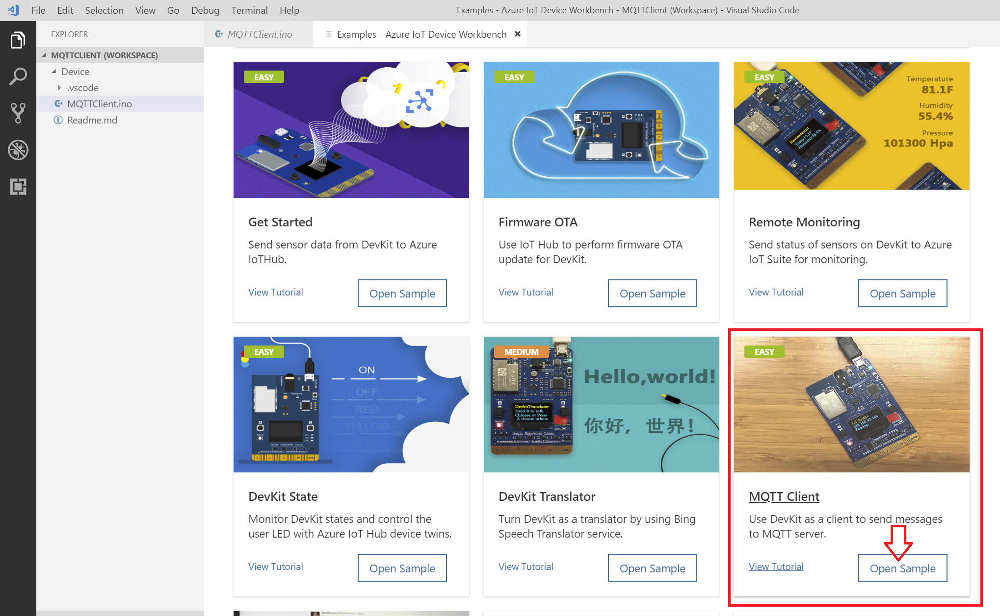

# Übung - 03: MQTT

## Ziel der Übung

In dieser Übung soll ein wenig Erfahrung mit dem MQTT Protokoll gesammelt werden. Hierzu sollen sowohl Publisher, als auch Subscriber implementiert werden.

Als MQTT Server/Broker verwenden wir den öffentlich zugänglicher IOT Server vom Paho Projekt von der Eclipse Foundation: 

 - Eclipse IoT projects available at iot.eclipse.org
 - port 1883 

---

## Aufgabe 1
Implementieren Sie eine Subscriber und einen Publisher in der Programmiersprache ihrer Wahl. Gute und einfache Anleitungen finden sich im Internet.

- Java: https://www.baeldung.com/java-mqtt-client
- Python: https://www.dinotools.de/2015/04/12/mqtt-mit-python-nutzen/
- JavaScript/Node : https://github.com/mqttjs/MQTT.js
- Elixir: https://github.com/gausby/tortoise

Verwenden Sie bitte den Server der Eclipse Foundation.

NOTE: Achten sie darauf welches Topic sie verwenden!

## Aufgabe 2

Verwenden Sie nun ihren MXChip und versuchen diesen als MQTT Publisher zu machen. 

!NOTE-BEGIN

Wer nicht das Sample als Startpunkt für sein Arduino Projekt verwenden möchte, kann es gerne ohne probieren. Hierzu muss nur ein *.ino File erstellt werden, der die entsprechenden Bibliotheken verwendet:

```C
#include <AZ3166WiFi.h>
#include "MQTTClient.h"
#include "MQTTNetwork.h"
```


und dann die init() und loop() Methoden implementieren. Das Wifi lässt sich über folgenden Code konfigurieren:

```c
void initWifi() {
  Screen.print(0, "Wi-Fi Connecting");
  Serial.print("Attempting to connect to Wi-Fi");
  
  if (WiFi.begin() == WL_CONNECTED) {
    IPAddress ip = WiFi.localIP();
    Screen.print(0, "Wi-Fi Connected");
    Screen.print(1, ip.get_address());
    hasWifi = true;
    Screen.print(2, "Running... \r\n");
  } else {
    Screen.print(1, "No Wi-Fi\r\n ");
  }
}
```
NOTE-END

Hierzu bietet sich als Startpunkt das MQTT Sample zu verwenden. Das lässt sich sehr gut über Visual Studio Code -> F1 -> Azure Iot Workbench:Open Examples... öffnen:



In dem Code muss vermutlich das Topic angepasst werden 

```
 const char* topic = "mqtt-sample";
 ```

 Ebenso sollte man evtl. den folgenden Code anpassen>

 ```
  data.clientID.cstring = (char*)"mqtt-sample";
  data.username.cstring = (char*)"testuser";
  data.password.cstring = (char*)"testpassword";
 ```

 Ob die Nachrichten ankommen, sollte mit dem Subscriber aus Aufgabe 1 kontrolliert werden können, solange Topic und so übereinstimmen.

 Evtl. Fragen Sie mal ihren Nachbarn nach dem Topic und subscriben auf die Nachrichten vom ihrem/seinem Device.

 Wenn soweit alles läuft, kann man mal probieren als Nachricht die Temperatur zu schicken und evtl. diese nur schicken, wenn ein Button am Device gedrückt wird. Einfach mal ein wenig mit dem Code experimentieren.